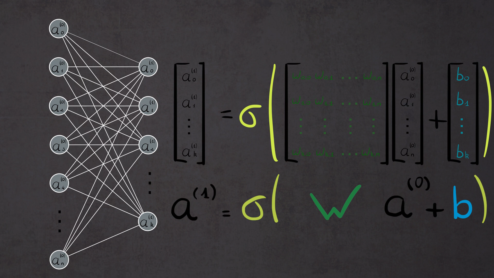

# A pratical introduction to deep learning

Thanks to Nils Lemonnier for this introduction. and illustration.

Deep learning is an artificial intelligence set of techniques which consists in training a network of virtual neurons to accomplish various tasks, that at least imply learning.

In this course, we will study very simple models. Our goal will me to experience an interaction with them, for if the mathematical concepts are similar to classic machine learning, the way to train and use neural networks is very different.

A huge variety of neural networks can be created. Here is a list :
https://www.asimovinstitute.org/neural-network-zoo/

## Key concepts

### Abstract view

An abstract neuron is a fonction with one or multiple inputs and outputs.

Neurons are organized in layers. You usually have an input layer, an output layer and from two to several hidden layers.nFor instance, if you want your network to recognize a handwritten number from 16 * 16 images, you may take one input neuron for each pixel, and 10 output neurons for each one of the base-10 numbers.

Neurons of different layers are linked with neurons of previous and next layers through a weighted connection. Each neuron will activate and choose a value in function of previous connections and also in function of an internal activation function. The information is propagated forward through those connections : this process is called Feed Forward.

The learning process is the progressive modification of each weight, in order to make the network output the correct answer.

In order to push the learning process in the right direction, we create a cost function. The further the network is from the result, the higher the cost is. We can thus know which weights participate the most to the wrong result. We modify those weights from output to the previous layer, then to the previous layer etc. This weight modification process is called Back Propagation.

### Mathematical tools

The internal activation functions of neurons are usually functions that can take any input value and convert them to a normalized value, for instance between -1 and 1 (hyperbolic tangeant) or between 0 and 1 (sigmoid).

Each neuron receives the sum of weighted values from previous neurons. We then add a neuron-dependant bias. The complete sum is used as an input for the activation function. The bias thus allow the neuron to activate more or less easily. At first, weights and biases are randomly selected. The bias value is modified along the back propagation process, as are the weights.

Mathematically, biases and layers are represented as vertical vectors. The weights between a layer and the previous layer are represented as a matrix. This image shows an example with the input layer and the first hiden layer:



We have discussed about the backpropagation process. We have to change all the weights in order to minimize the cost function. Should we test all possible values for weights, it would take severay millions of years to check all possible values.

Imagine we just have one weight to modify in order to reduce the cost. We can draw a diagram of the cost in function of the weight value. Using the derivative of this cost function, we can try to change the weight in the right direction to progressively find the minimal cost. You already know this technique, called gradient descent. Now, we can use gradient descent with any number of dimensions, so with any number of weights.

Some mathematical reminders.

Matrices and linear algreba
https://www.youtube.com/watch?v=fNk_zzaMoSs

Derivatives:
https://www.youtube.com/watch?v=9vKqVkMQHKk

### Training set and test set

In order to train our future neural networks, we will use labeled traning data sets.

Once the network is trained, we can use a test data set to check the neural network can adapt to new situations.

## A simple example

We will code with python one of the simplest neural network. It will only work with weights, without any bias.

### Prerequisites

Please install python, then in a terminal:
```
pip install numpy
pip install matplotlib
```

### Goal and structure

Inputs of our neural network is a vector of 4 0/1 number. We want the network to output 1 when the second and third number of the input are ones, 0 else.

The network will have 4 inputs, 1 hidden layer of 4 neurons and 1 output neuron.

### Code

Create a python file for our code. First, let's create needed variable and functions.

```
import numpy as np
np.random.seed(1) # Random generation will be the same each time

# Variables to store plot variables
# Allow to visualize error of the network in function of time
import matplotlib.pyplot as plt
xGraphCostFunction=[]
yGraphCostFunction=[]

# Neuron activation function: sigmoid
def sigmoid(x):
    return 1 / (1 + np.exp(-x))

# Derivative of the activation function
def sigmoidPrime(x):
    return x * (1 - x)
```

The, let's create the data we need for training and use a random initilization on our neural netwok.

```
#===================================
#           Create data
#===================================

# Input data
inputs = np.array([ [0, 0, 0, 1],
                    [0, 0, 1, 1],
                    [0, 1, 1, 1],
                    [1, 0, 1, 0],
                    [1, 1, 1, 1]])

# Intended output
answers = np.array([[0],
                    [0],
                    [1],
                    [0],
                    [1]])

# Test data, to check the network is well trained
inputs_test = np.array([[1, 1, 1, 0],
                        [0, 1, 1, 0],
                        [0, 0, 1, 0],
                        [1, 0, 0, 0]])
#----------------------------------------


#------------------   Dimensions of neural network 
nb_input_neurons = 4
nb_hidden_neurons = 4
nb_output_neurons = 1
#------


# Random init for each neuron between -1 and 1
hidden_layer_weights = 2 * np.random.random((nb_input_neurons, nb_hidden_neurons)) - 1
output_layer_weights = 2 * np.random.random((nb_hidden_neurons, nb_output_neurons)) - 1
```

Now, let's train the neural netwrok:

```
#===================================
#           Training Phase
#===================================

# Number of iteration for the training phase
nb_training_iteration = 10000

for i in range(nb_training_iteration):

    #---------------- FEED FORWARD -----------------
    # Broadcast information forward in neural network

    input_layer = inputs
    # Feedforward between input layer and hidden layer
    hidden_layer = sigmoid(np.dot(input_layer, hidden_layer_weights))
    # Feedforward between hidden layer and ouput layer
    output_layer = sigmoid(np.dot(hidden_layer, output_layer_weights))  

    # ---------------- BACKPROPAGATION -----------------

    # Comput cost for each data. The goal is to dimish cost quickly.
    output_layer_error = (answers - output_layer)
    print("Error: " + str(output_layer_error))
    # output_layer_error = []

    # Compute a value with which we will correct weights 
    # between hidden and output layers
    output_layer_delta = output_layer_error * sigmoidPrime(output_layer)

    # Which are the weights between input and hidden layer 
    # that contributed to the cost, in which propotion?
    hidden_layer_error = np.dot(output_layer_delta, output_layer_weights.T)

    # Compute a value with which we will correct weights 
    # between input and hidden layers
    hidden_layer_delta = hidden_layer_error * sigmoidPrime(hidden_layer)


    # Correct weights
    output_layer_weights += np.dot(hidden_layer.T,output_layer_delta)
    hidden_layer_weights += np.dot(input_layer.T,hidden_layer_delta)

    # Display costs
    if (i % 10) == 0:
        # Compute the mean of all errors' values
        cout = str(np.mean(np.abs(output_layer_error))) 
        print("Cost:" + cout)

        # Graph X -> Iterate through learning loop
        xGraphCostFunction.append(i)
        # Graph Y -> Cost value (3 numbers after comma)
        v = float("{0:.3f}".format(float(cout)))
        yGraphCostFunction.append(v)
```

Now the neural network is trained, we can test it:

```
#===================================
#           Test Phase
#===================================

# Use the trained network with the test data
input_layer = inputs_test
hidden_layer = sigmoid(np.dot(input_layer, hidden_layer_weights))
output_layer = sigmoid(np.dot(hidden_layer, output_layer_weights))

# Print result
print("------")
print("Result : ")
print(str(output_layer))

# Display graph
plt.plot(xGraphCostFunction, yGraphCostFunction)
plt.show()
```